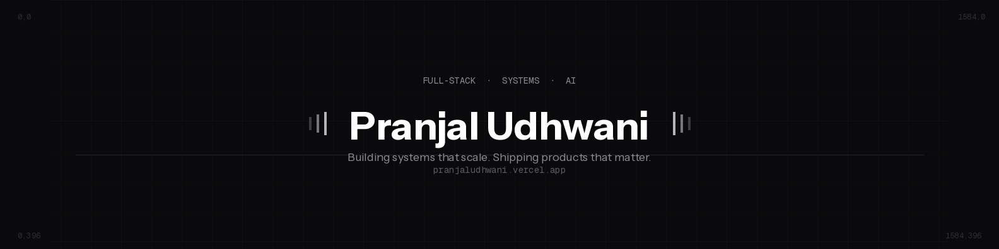

 

  &nbsp;
  &nbsp;
  

 

  <code>CS final year · Chitkara University · Chandigarh, India</code> 
  <code>I build production-grade full-stack systems with real AI in them — not demos.</code> 
  <code>TypeScript · Python · React · Node.js · PostgreSQL · Docker</code>

  <b>Open to: SDE / AI Engineer roles &nbsp;·&nbsp; Available from: [your date]</b>

 

---

### What I've Shipped

<table>
  <tr>
    <td width="50%">
      <h4><a href="https://github.com/Pranjal0410/Real-Time-Incident-Response-System">Real-Time Incident Response System</a></h4>
      Live detection → alert → response coordination via WebSockets. Sub-second latency. Handles concurrent incidents in a production-grade architecture — not a toy project.  
      <code>JavaScript</code> <code>WebSockets</code> <code>Real-Time Systems</code>
    </td>
    <td width="50%">
      <h4><a href="https://github.com/Pranjal0410/AI-CareerCoach">AI Career Coach</a></h4>
      End-to-end AI pipeline — resume parsing, gap analysis, personalized recommendations. Not a ChatGPT wrapper. Actual LLM integration with structured output.  
      <code>JavaScript</code> <code>LLM Integration</code> <code>Full-Stack</code>
    </td>
  </tr>
  <tr>
    <td width="50%">
      <h4><a href="https://github.com/Pranjal0410/real-estate-project">Real Estate Platform</a></h4>
      Full-stack property management with Java + Spring Boot backend, PostgreSQL, and search/filter at scale. Designed with production data modeling in mind.  
      <code>Java</code> <code>Spring Boot</code> <code>PostgreSQL</code>
    </td>
    <td width="50%">
      <h4><a href="https://pranjaludhwani.vercel.app/">Portfolio</a></h4>
      Designed and built from scratch. Project showcase, technical writing, and contact — deployed on Vercel with zero downtime.  
      <code>Next.js</code> <code>TypeScript</code> <code>Vercel</code>
    </td>
  </tr>
</table>

---

### Stack

  &nbsp;&nbsp;&nbsp;
  &nbsp;&nbsp;&nbsp;
  

  <b>Languages</b>&nbsp;&nbsp;&nbsp;&nbsp;&nbsp;&nbsp;&nbsp;&nbsp;&nbsp;&nbsp;&nbsp;&nbsp;&nbsp;&nbsp;&nbsp;&nbsp;&nbsp;&nbsp;&nbsp;&nbsp;&nbsp;&nbsp;&nbsp;&nbsp;&nbsp;<b>Frameworks</b>&nbsp;&nbsp;&nbsp;&nbsp;&nbsp;&nbsp;&nbsp;&nbsp;&nbsp;&nbsp;&nbsp;&nbsp;&nbsp;&nbsp;&nbsp;&nbsp;&nbsp;&nbsp;&nbsp;&nbsp;&nbsp;&nbsp;&nbsp;&nbsp;&nbsp;&nbsp;<b>Infrastructure</b>

---

  Systems over scripts. Products over prototypes.

